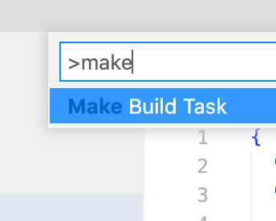
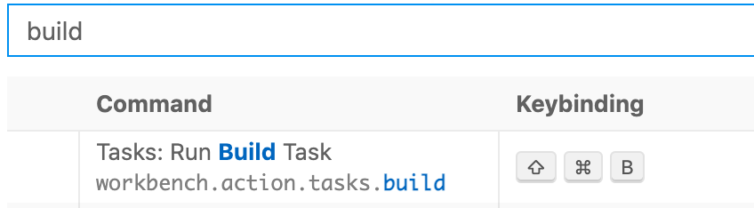

# Make Build Task (for vscode)
Sets up default build task by configuring "package.json" and "tasks.json" with a default build task.

When a "default" build task is defined, it allows you to quickly build your project with a keyboard shortcut.

NOTE: While this sets things up for a javascript environment, ( npm node javascript ), the setup can easily be manually tweaked for others.

The intent of this project is just to configure your vscode project with a default build task quickly, without having to fumble through confusing commands, missing templates, or burried documentation. 

Personally, each time i want to set up a default build task, i have to google how to do it -- just can't remember all the little things needed.

## Usage
Open command (command+shift+P) and type "make build task"

## What It Does
The extension does 3 things:

1. Adds an entry to the "scripts" in "packages.json" as:

		{
			"name": "some project",
			"version": "1.0.0",
			"description": "",
			"scripts": {
				"myDefaultBuildTask": "node ./build.js" // <--- here
			},
			"author": "mike gieson",
			"license": "ISC",
			"dependencies": {
				"myfs": "^1.0.22"
			}
		}

2. Adds a "tasks" entry to ".vscode/tasks.json" as:

		{
			"tasks": [
				{
					"type": "npm",
					"script": "myDefaultBuildTask",
					"group": {
						"kind": "build",
						"isDefault": true
					}
				}
			]
		}

3. Creates a "build.js" at root of project (if not exist). Of course the build.js file is up to you to author.

## Changing default build shortcut
By default, vscode sets the default build task's keyboard shortcut to:

Mac: command+shift+B
PC: ctrl+shift+B

Which allows you to build your project with a keyboard shortcut.

You can configure this to be a different shortcut from vscode > Preferences > Keyboard Shortcuts. And typing "build" into the search:

## Change Log
v0.0.7 - 2023-09-08 @ 23:49:17
- create package.json (if not exist)
- create .vscode/tasks.json (if not exists)
- use myfs to simplify dir/file read wrte